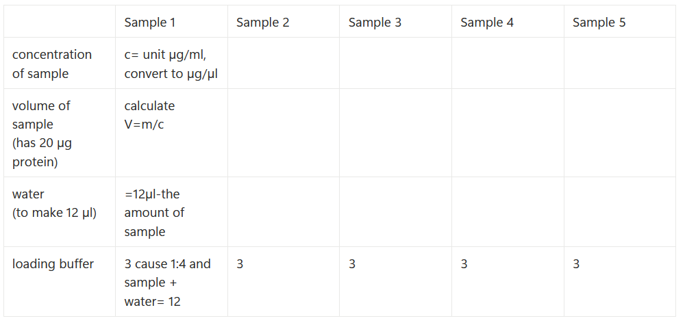

# Welcome to view tools made by me, Henna Kultalahti

## 🖥️ Lab automation tools

The first tool I'm independently developing (planning, writing scripts, testing) is a tool that can be used in Western Blot.
Traditionally, what is loaded into wells for the running of WB is calculated for example as shown below.

My goal is to create a python based program that asks the needed information from user, does the calculations and output then consists of everything needed for each well. It should also warn when there are problems.

### ❓ Questions asked from user

1. How many samples (wells) do you have?
2. What is the protein concentration of each sample (µg/µl)?
3. How much protein do you want in well (µg)? Assuming same amount for each well.
4. Final volume of loaded mixutere in well (µl)?
5. What is the concentration of laoding buffer (e.g. 1x or 4x etc.) Write number only.

